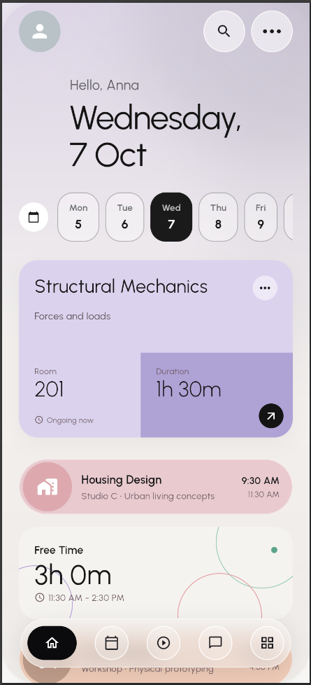
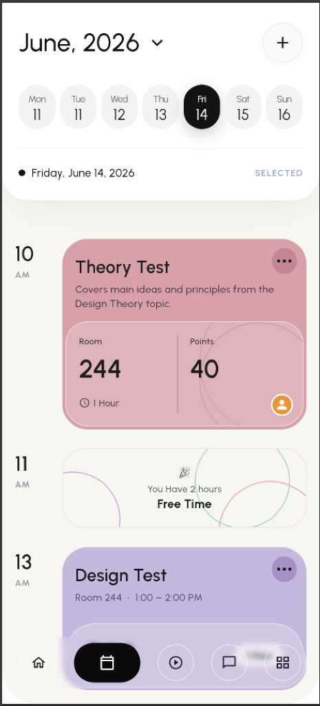
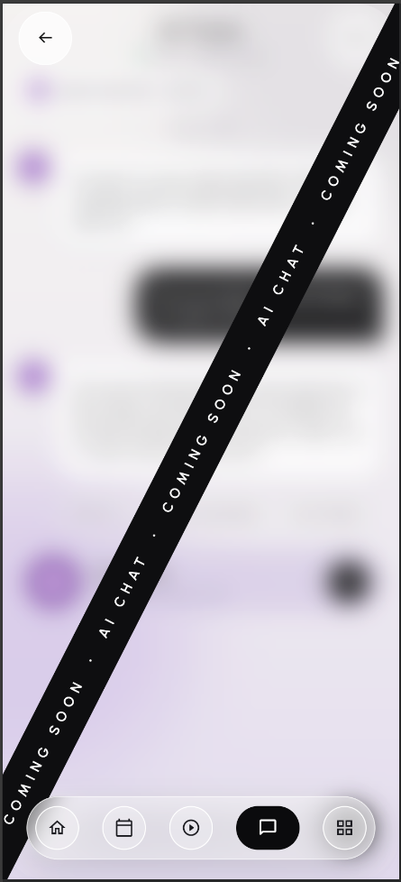
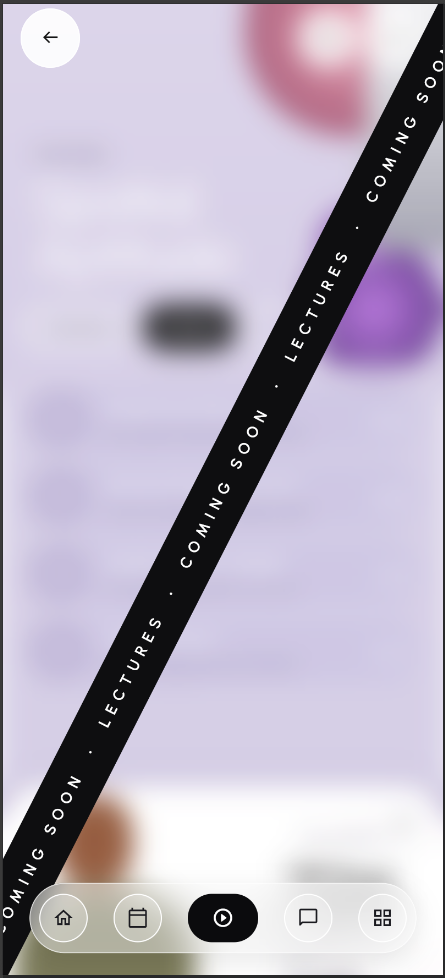
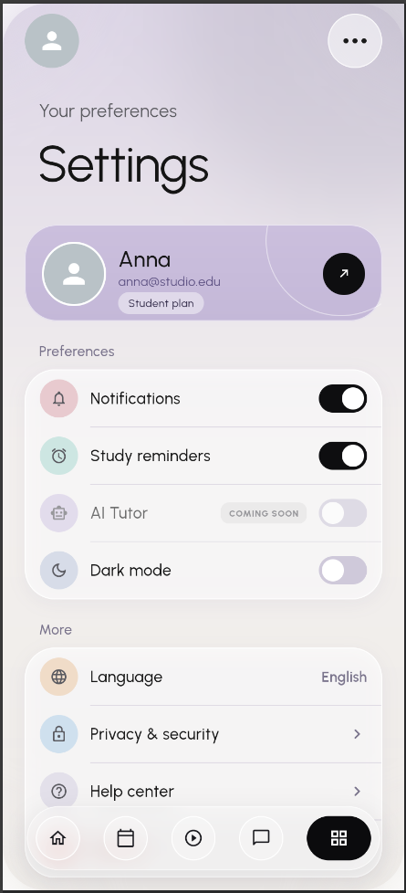

<div align="center">
  <h1>🎓 Custom Syllabus</h1>
  <p><strong>AI-Powered Academic Planner & Timetable Analyzer</strong></p>
  <p>
    A next-generation application bridging intelligent schedule extraction with an ultra-premium, modern user interface.
  </p>
</div>

---

## 📖 Overview
**Custom Syllabus** revolutionizes how students and professionals manage their academic lives. By leveraging the **Google Gemini Pro AI**, it seamlessly extracts and structures schedule entries from uploaded images or PDF syllabuses. 

The frontend is built in **Flutter**, showcasing a state-of-the-art glassmorphic design system with carefully crafted animations. The robust backend is powered by **FastAPI** in Python, ensuring rapid and asynchronous processing of AI workloads.

## ✨ Key Features
- **🤖 Intelligent Timetable Analysis**: Upload a syllabus (PDF/Image) and let Gemini AI instantly map out your schedule and extract structured JSON data.
- **🎨 Glassmorphic UI/UX**: Ultra-premium fluid animations, customized Google Fonts (*Urbanist*), and a stunning frosted-glass aesthetic.
- **📅 Dynamic Scheduling**: Real-time progress tracking of ongoing classes and elegant daily breakdowns.
- **⚙️ Configurable Preferences**: Seamless dark/light mode toggles and extensive notification/study settings.
- **🚀 Future-Ready Architecture**: Pluggable modules and designated UI layers prepared for upcoming AI Chat Tutoring and Interactive Lecture materials.

---

## 📱 Interface Showcase

We believe in design excellence and uncompromised user experience. Below are snapshots of the application's core screens.

<div align="center">
  <table>
    <tr>
      <td align="center"><strong>Home Dashboard</strong></td>
      <td align="center"><strong>Daily Schedule</strong></td>
    </tr>
    <tr>
      <td></td>
      <td></td>
    </tr>
    <tr>
      <td align="center"><strong>AI Chat (Coming Soon)</strong></td>
      <td align="center"><strong>Lectures (Coming Soon)</strong></td>
    </tr>
    <tr>
      <td></td>
      <td></td>
    </tr>
    <tr>
      <td align="center" colspan="2"><strong>Settings & Preferences</strong></td>
    </tr>
    <tr>
      <td colspan="2" align="center"></td>
    </tr>
  </table>
</div>

---

## 🏗️ Technical Architecture

- **Frontend:** Built with Flutter (Dart). Utilizes custom explicit animations, BackdropFilters for authentic glassmorphism, and an optimized state routing loop.
- **Backend:** Built with Python & FastAPI. A lightweight, type-safe, and asynchronous API.
- **AI Core:** Integrates `google-genai` SDK using the `gemini-2.5-pro` model for high-fidelity structured data extraction (`response_mime_type="application/json"`).

---

## 🚀 Getting Started

### Prerequisites
- Flutter SDK (stable channel recommended)
- Python 3.10+
- Google Gemini API Key

### 1. Backend Setup
```bash
cd backend
python -m venv venv
source venv/bin/activate  # On Windows use `venv\Scripts\activate`
pip install fastapi uvicorn google-genai python-dotenv pydantic python-multipart
```
*Configure your environment variables:*
Create a `.env` file in the `backend/` directory:
```env
GEMINI_API_KEY=your_api_key_here
```
*Run the API:*
```bash
uvicorn main:app --reload
```

### 2. Frontend Setup
```bash
cd frontend
flutter pub get
flutter run
```

---

## 🗺️ Roadmap
- [x] Syllabus AI Extraction Pipeline (FastAPI + Gemini)
- [x] Home & Schedule Core UI (Glassmorphism & Animations)
- [x] Settings & Preferences Scaffold
- [ ] Implement AI Chat Tutor Engine
- [ ] Implement Interactive Lecture Materials
- [ ] Push Notifications for Upcoming Classes
- [ ] Secure Cloud Synchronization (Firebase)

---
<div align="center">
  <i>Architected for excellence. Built for students.</i>
</div>
